# BDR : Laboratoire n⁰ 3

## Par Tim Van Hove et Thomas Germano

### Exercices

#### Exercice 1

##### Requête

```sql
SELECT
    customer_id,
    last_name AS "nom",
    email
FROM customer c
         INNER JOIN store s
                    ON c.store_id = s.store_id
WHERE c.first_name = 'PHYLLIS'
ORDER BY 
	customer_id DESC;
```

##### Résultat


#### Exercice 2

##### Requête

```sql
SELECT
    title AS "titre",
    release_year AS "annee_sortie",
    rating
FROM film f
WHERE f.rating = 'R'
  AND f.length < 60
  AND f.replacement_cost = 12.99
ORDER BY 
	f.title;
```

##### Résultat

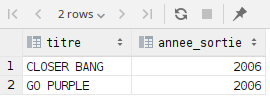

#### Exercice 3

##### Requête

```sql
SELECT
    country,
    city,
    postal_code
FROM address a
         INNER JOIN city c
                    ON a.city_id = c.city_id
         INNER JOIN country co
                    ON c.country_id = co.country_id
WHERE co.country = 'France'
  OR (co.country_id >= 63
  AND co.country_id <= 67)
ORDER BY 
	co.country, 
	c.city, 
	a.postal_code;
```

##### Résultat


#### Exercice 4

##### Requête

```sql
SELECT
    customer_id,
    first_name AS "prenom",
    last_name AS "nom"
FROM customer c
        INNER JOIN address a
            ON c.address_id = a.address_id
        INNER JOIN store s
            ON c.store_id = s.store_id
WHERE city_id = 171
  AND c.store_id = 1
  AND c.active
ORDER BY 
	first_name;
```

##### Résultat


#### Exercice 5

##### Requête

```sql
SELECT
    c1.first_name AS prenom_1,
    c1.last_name AS nom_1,
    c2.first_name AS prenom_2,
    c2.last_name AS nom_2
FROM film f
         INNER JOIN inventory i 
         	ON f.film_id = i.film_id
         INNER JOIN rental r1 
         	ON i.inventory_id = r1.inventory_id
         INNER JOIN rental r2 
         	ON i.inventory_id = r2.inventory_id AND r1.customer_id <> r2.customer_id
         INNER JOIN customer c1 
         	ON r1.customer_id = c1.customer_id
         INNER JOIN customer c2 
         	ON r2.customer_id = c2.customer_id;
```

##### Résultat

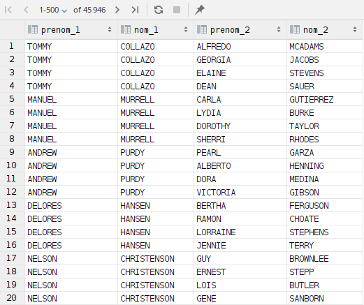

#### Exercice 6

##### Requête

```sql
SELECT DISTINCT
    last_name as "nom",
    first_name as "prenom"
FROM actor
WHERE actor_id IN(
    SELECT actor_id
    FROM film_actor
    WHERE film_id IN (
        SELECT film_id
        FROM film
        WHERE film_id IN (
            SELECT film_id
            FROM film_category
            WHERE category_id IN (
                SELECT category_id
                FROM category
                WHERE name = 'Horror'
            )
        )
    )
)
AND (first_name LIKE 'K%'
OR last_name LIKE 'D%');
```

##### Résultat

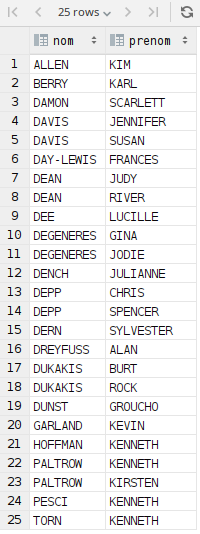

#### Exercice 7 a)

##### Requête

```sql
SELECT DISTINCT
	f1.film_id AS "id",
    title AS "titre",
    rental_rate / rental_duration AS "prix_de_location_par_jour"
FROM film f1
WHERE rental_rate / rental_duration <= 1
  AND film_id NOT IN (SELECT f2.film_id
                      FROM film f2
                      	INNER JOIN inventory i 
                      		ON f2.film_id = i.film_id
                        INNER JOIN rental r 
                      		ON i.inventory_id = r.inventory_id);
```

##### Résultat

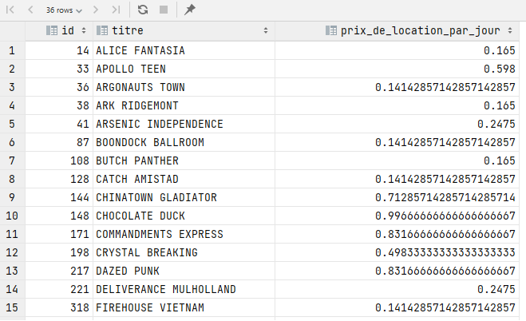

#### Exercice 7 b)

##### Requête

```sql
SELECT DISTINCT
	f1.film_id AS "id",
    f1.title AS "titre",
    f1.rental_rate / f1.rental_duration AS "prix_de_location_par_jour"
FROM film f1
WHERE rental_rate / rental_duration <= 1
EXCEPT
SELECT
	f2.film_id AS "id", 
	f2.title AS "titre",
    f2.rental_rate / f2.rental_duration AS "prix_de_location_par_jour"
FROM film f2
         INNER JOIN inventory i 
         	ON f2.film_id = i.film_id
         INNER JOIN rental r 
         	ON i.inventory_id = r.inventory_id;       
```

##### Résultat

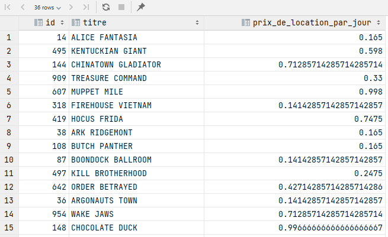

#### Exercice 8 a)

##### Requête

```sql
SELECT DISTINCT
    c.customer_id AS "id",
    last_name AS "nom",
    first_name AS "prenom"
FROM customer c
    INNER JOIN address a
        ON a.address_id = c.address_id
    INNER JOIN city ci
        ON a.city_id = ci.city_id
    INNER JOIN country co
        ON ci.country_id = co.country_id
WHERE co.country = 'Spain'
AND EXISTS(SELECT
               r.customer_id
           FROM rental r
           WHERE return_date IS NULL 
             AND c.customer_id = r.customer_id
);
```

##### Résultat


#### Exercice 8 b)

##### Requête

```sql
SELECT DISTINCT
    c.customer_id AS "id",
    last_name AS "nom",
    first_name AS "prenom"
FROM customer c
    INNER JOIN address a
        ON a.address_id = c.address_id
    INNER JOIN city ci
        ON a.city_id = ci.city_id
    INNER JOIN country co
        ON ci.country_id = co.country_id
WHERE co.country = 'Spain'
AND c.customer_id IN(SELECT customer_id 
                     FROM rental 
                     WHERE return_date IS NULL);
```

##### Résultat


#### Exercice 8 c)

##### Requête

```sql
SELECT DISTINCT
    c.customer_id AS "id",
    last_name AS "nom",
    first_name AS "prenom"
FROM customer c
    INNER JOIN address a
        ON a.address_id = c.address_id
    INNER JOIN city ci
        ON a.city_id = ci.city_id
    INNER JOIN country co
        ON ci.country_id = co.country_id
    INNER JOIN rental r
        ON c.customer_id = r.customer_id
WHERE co.country = 'Spain'
AND r.return_date IS NULL;
```

##### Résultat


#### Exercice 9

##### Requête

```sql
SELECT DISTINCT
    c.customer_id as "numéro",
    c.last_name as "nom",
    c.first_name as "prénom"
FROM customer c
    INNER JOIN rental r
        ON c.customer_id = r.customer_id
    INNER JOIN inventory i
        ON r.inventory_id = i.inventory_id
    INNER JOIN film f
        ON f.film_id = i.film_id
    INNER JOIN film_actor fa
        ON f.film_id = fa.film_id
    INNER JOIN actor a
        ON fa.actor_id = a.actor_id
WHERE a.first_name = 'EMILY'
AND a.last_name = 'DEE'
GROUP BY 
	c.customer_id, 
	c.last_name, 
	c.first_name
HAVING COUNT(DISTINCT i.film_id) = (
    SELECT COUNT(*)
    FROM actor a
        INNER JOIN film_actor fa
            ON a.actor_id = fa.actor_id
        INNER JOIN film f
            ON fa.film_id = f.film_id
    WHERE a.first_name = 'EMILY'
    AND a.last_name = 'DEE'
);
```

##### Résultat

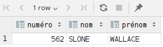

#### Exercice 10

##### Requête

```sql
SELECT
    f.title AS "titre",
    count(*) AS "nb_acteurs"
FROM film f
    INNER JOIN film_actor fa
        ON f.film_id = fa.film_id
    INNER JOIN film_category fc
        ON f.film_id = fc.film_id
    INNER JOIN category c
        ON fc.category_id = c.category_id
WHERE c.name = 'Drama'
GROUP BY 
	f.title
HAVING COUNT(*) < 5
ORDER BY 
	COUNT(*) DESC;
```

##### Résultat


#### Exercice 11

##### Requête

```sql
SELECT
	c.category_id AS "id",
	c.name AS "nom",
	COUNT(*) AS "nb_films"
FROM film f
         INNER JOIN film_category fc on f.film_id = fc.film_id
         INNER JOIN category c on fc.category_id = c.category_id
GROUP BY 
	c.name, 
	c.category_id
HAVING COUNT(*) > 65
ORDER BY 
	nb_films;
```

##### Résultat

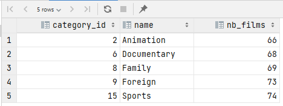

#### Exercice 12

##### Requête

```sql
SELECT
    film_id AS "id",
    title AS "titre",
    length AS "duree"
FROM film
WHERE length IN(
    SELECT
        MIN(length)
    FROM film);
```

##### Résultat


#### Exercice 13 a)

##### Requête

```sql
SELECT DISTINCT 
	f.film_id AS id, 
	f.title AS titre
FROM film f
         INNER JOIN film_actor fa 
         	ON f.film_id = fa.film_id
WHERE fa.actor_id IN (SELECT actor_id
                      FROM film_actor fa
                      GROUP BY fa.actor_id
                      HAVING COUNT(*) > 40);
```

##### Résultat

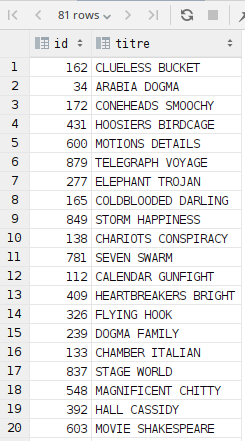

#### Exercice 13 b)

##### Requête

```sql
SELECT DISTINCT 
	f.film_id AS id, 
	f.title AS titre
FROM film f
         INNER JOIN film_actor fa 
         	ON f.film_id = fa.film_id
         INNER JOIN (SELECT fa.actor_id
                     FROM film_actor fa
                     GROUP BY fa.actor_id
                     HAVING COUNT(*) > 40) AS actors 
         	ON fa.actor_id = actors.actor_id;
```

##### Résultat

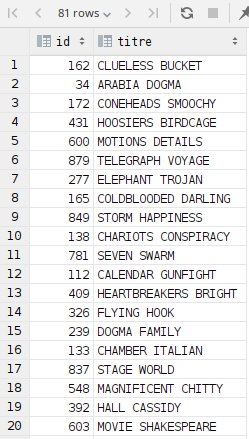

#### Exercice 14

##### Requête

```sql
SELECT 
    CEIL(SUM(length) / (8. * 60.)) AS "nb_jours"
FROM film;
```

##### Résultat


P.S. : nous avons décidé d'arrondir le résultat au supérieur afin de donner un chiffre permettant de réellement regarder toute la filmographie présente en stock.

#### Exercice 15

##### Requête

```sql
SELECT
    c.customer_id AS "id",
    last_name AS "nom",
    email,
    country AS "pays",
    COUNT(r.rental_id) AS "nb_locations",
    SUM(p.amount) AS "depense_totale",
    AVG(p.amount) AS "depense_moyenne"
FROM customer c
    INNER JOIN address a
        ON a.address_id = c.address_id
    INNER JOIN city ci
        ON ci.city_id = a.city_id
    INNER JOIN country co
        ON co.country_id = ci.country_id
    INNER JOIN rental r
        ON c.customer_id = r.customer_id
    INNER JOIN payment p
        ON r.rental_id = p.rental_id
WHERE country = 'Switzerland'
OR country = 'France'
OR country = 'Germany'
GROUP BY  
	c.customer_id, 
	last_name, 
	email, 
	country
HAVING AVG(p.amount) > 3.0
ORDER BY 
	country, 
	c.last_name;
```

##### Résultat

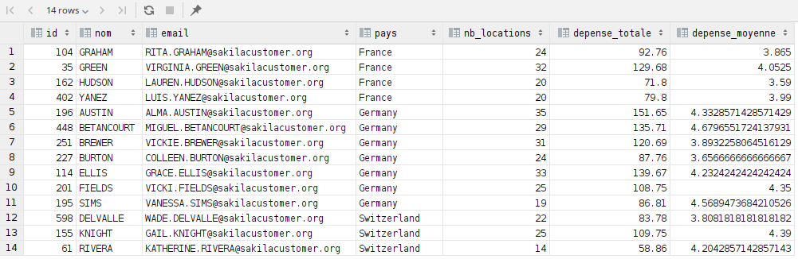

#### Exercice 16 a)

##### Requête

```sql
SELECT COUNT(*)
FROM payment
WHERE amount <= 9;
```

##### Résultat

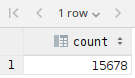

#### Exercice 16 b)

##### Requête

```sql
DELETE
FROM payment
WHERE amount <= 9;
```

##### Résultat

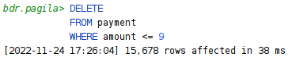

#### Exercice 16 c)

##### Requête

```sql
SELECT COUNT(*)
FROM payment
WHERE amount <= 9;
```

##### Résultat

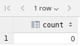

#### Exercice 17

##### Requête

```sql
UPDATE payment
    SET amount = amount * 1.5, 
        payment_date = NOW()
WHERE
    amount > 4;
```

##### Résultat

###### Avant

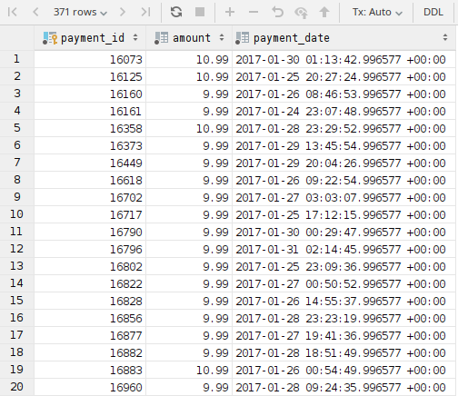

###### Après

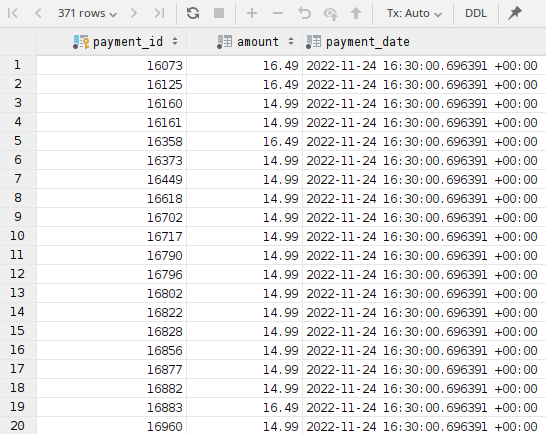

#### Exercice 18

##### Requête

```sql
INSERT INTO city (city, country_id)
VALUES (
        'Nyon',
        (SELECT 
         	country_id 
         FROM country 
         WHERE country = 'Switzerland')
);

INSERT INTO address (address, district, city_id, postal_code, phone)

VALUES (
        'Rue du centre',
        'Vaud',
        (SELECT 
         	city_id 
         FROM city 
         WHERE city = 'Nyon'),
        '1260',
        '0213600000'
);

INSERT INTO customer (store_id, first_name, last_name, email, address_id, active)

VALUES (
        1,
        'GUILLAUME',
        'RANSOME',
        'gr@bluewin.ch',
        (SELECT 
         	address_id 
         FROM address 
         WHERE address = 'Rue du centre'),
        TRUE
);

SELECT
    first_name, 
    last_name, 
    address, 
    postal_code, 
    city, 
    country, 
    phone, 
    email, 
    customer.store_id
FROM customer
    INNER JOIN address a 
    	ON a.address_id = customer.address_id
    INNER JOIN city ci 
    	ON ci.city_id = a.city_id
    INNER JOIN country c 
    	ON ci.country_id = c.country_id
WHERE first_name = 'GUILLAUME'
AND last_name = 'RANSOME';
```

##### Résultat


##### Réponses aux questions

###### b)

Car les IDs sont, dans cette base de données, la clé primaire de chaque table. En conséquence, les IDs doivent être `UNIQUE` et `NOT NULL`, ce qui fait que la base de données préfère les générer automatiquement elle-même et ne laisse pas le choix à l'utilisateur afin d'être sûr que les IDs valident bien ces conditions. 
