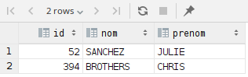

# HEIG_BDR_Labo3
```sql
SET search_path TO pagila;
-- Thomas Paire, Tim Impair
-- Exercice 1
SELECT customer_id, last_name, email
FROM customer c
         INNER JOIN store s
                    on c.store_id = s.store_id
WHERE c.first_name = 'PHYLLIS'
ORDER BY customer_id DESC;

-- Exercice 2
SELECT title, release_year
FROM film f
WHERE f.rating = 'R'
  AND f.length < 60
  AND f.replacement_cost = 12.99
ORDER BY f.title;

-- Exercice 3
SELECT country, city, postal_code
FROM address a
         INNER JOIN city c
                    on a.city_id = c.city_id
         INNER JOIN country co
                    on c.country_id = co.country_id

WHERE co.country = 'France'
   OR (co.country_id >= 63
    AND co.country_id <= 67)
ORDER BY co.country, c.city, a.postal_code;

-- Exercice 4
SELECT customer_id, first_name, last_name
FROM customer c
         INNER JOIN address a
                    on c.address_id = a.address_id
         INNER JOIN store s
                    on c.store_id = s.store_id
WHERE city_id = 171
  AND c.store_id = 1
  AND c.active
ORDER BY first_name;

-- Exercice 5
SELECT c1.first_name, c1.last_name, c2.first_name, c2.last_name, i.film_id
FROM film f
         INNER JOIN inventory i on f.film_id = i.film_id
         INNER JOIN rental r1 on i.inventory_id = r1.inventory_id
         INNER JOIN rental r2 on i.inventory_id = r2.inventory_id AND r1.customer_id <> r2.customer_id
         INNER JOIN customer c1 on r1.customer_id = c1.customer_id
         INNER JOIN customer c2 on r2.customer_id = c2.customer_id;

-- Exercice 6
SELECT last_name, first_name
FROM actor
WHERE actor_id IN (SELECT actor_id
                   FROM film_actor
                   WHERE film_id IN (SELECT film_id
                                     FROM film
                                     WHERE film_id IN (SELECT film_id
                                                       FROM film_category
                                                       WHERE category_id IN (SELECT category_id
                                                                             FROM category
                                                                             WHERE name = 'Horror'))))
  AND (substr(first_name, 1, 1) = 'K'
    OR (substr(last_name, 1, 1)) = 'D');
	
	
-- Exercice 7 a) Avec NOT IN

SELECT f.film_id, title, ROUND(rental_rate / rental_duration, 3) AS daily_location_price
FROM film f
         INNER JOIN inventory i on f.film_id = i.film_id
WHERE i.inventory_id NOT IN (SELECT inventory_id
                             FROM rental)
  AND f.rental_rate / f.rental_duration < 1;

-- Exercice 7 b) Avec opération ensembliste

SELECT f.film_id, title, ROUND(rental_rate / rental_duration, 3) AS daily_location_price
FROM film f
         INNER JOIN inventory i on f.film_id = i.film_id
WHERE (i.inventory_id =
       (SELECT inventory_id
        FROM inventory
        EXCEPT
        (SELECT inventory_id
         FROM rental)))
  AND f.rental_rate / f.rental_duration < 1;

-- Exercice 8 a)
SELECT DISTINCT c.customer_id, last_name, first_name
FROM customer c
         INNER JOIN address a on a.address_id = c.address_id
         INNER JOIN city ci on a.city_id = ci.city_id
         INNER JOIN country co on ci.country_id = co.country_id
WHERE co.country = 'Spain'
  AND EXISTS(SELECT r.customer_id FROM rental r where return_date IS NULL AND c.customer_id = r.customer_id);

-- Exercice 8 b)
SELECT DISTINCT c.customer_id, last_name, first_name
FROM customer c
         INNER JOIN address a on a.address_id = c.address_id
         INNER JOIN city ci on a.city_id = ci.city_id
         INNER JOIN country co on ci.country_id = co.country_id
WHERE co.country = 'Spain'
  AND c.customer_id IN (SELECT customer_id FROM rental where return_date IS NULL);

-- Exercice 8 c)
SELECT DISTINCT c.customer_id, last_name, first_name
FROM customer c
         INNER JOIN address a on a.address_id = c.address_id
         INNER JOIN city ci on a.city_id = ci.city_id
         INNER JOIN country co on ci.country_id = co.country_id
         INNER JOIN rental r on c.customer_id = r.customer_id
WHERE co.country = 'Spain'
  AND r.return_date IS NULL;

-- Exercice 10
SELECT f.title, COUNT(*) AS "nb_actors"
FROM film f
         INNER JOIN film_actor fa on f.film_id = fa.film_id
         INNER JOIN film_category fc on f.film_id = fc.film_id
         INNER JOIN category c on fc.category_id = c.category_id
WHERE c.name = 'Drama'
GROUP BY f.title
HAVING COUNT(*) < 5
ORDER BY COUNT(*) DESC;

-- Exercice 11
SELECT c.category_id, c.name, COUNT(*) AS nb_films
FROM film f
         INNER JOIN film_category fc on f.film_id = fc.film_id
         INNER JOIN category c on fc.category_id = c.category_id
GROUP BY c.name, c.category_id
HAVING COUNT(*) > 65
ORDER BY nb_films;

-- Exercice 12
SELECT film_id, title, length
FROM film
WHERE length IN (SELECT min(length) FROM film)
ORDER BY length;

-- Exercice 13 a)
SELECT DISTINCT f.film_id, f.title
FROM film f
         INNER JOIN film_actor fa on f.film_id = fa.film_id
WHERE fa.actor_id IN (SELECT actor_id
                      FROM film_actor fa
                      GROUP BY fa.actor_id
                      HAVING COUNT(*) > 40);

-- Exercice 13 b)
SELECT DISTINCT f.film_id, f.title
FROM film f
         INNER JOIN film_actor fa on f.film_id = fa.film_id
         INNER JOIN (SELECT fa.actor_id
                     FROM film_actor fa
                     GROUP BY fa.actor_id
                     HAVING COUNT(*) > 40) actors on fa.actor_id = actors.actor_id;

-- Exercice 14
SELECT ceil(sum(length) / (8. * 60.)) AS "nb_jours"
FROM film;

-- Exercice 16 a)
SELECT count(*)
FROM payment
WHERE amount <= 9;
-- résultat : 15'678

-- Exercice 16 b)
DELETE
FROM payment
WHERE amount <= 9;

-- Exercice 16 c)
SELECT count(*)
FROM payment
WHERE amount <= 9;
-- résultat : 0

-- Exercice 18
INSERT INTO city
VALUES (((SELECT max(city_id) FROM city) + 1), 'Nyon', (SELECT country_id FROM country where country = 'Switzerland'),
        now());

INSERT INTO address
VALUES (((SELECT max(address_id) FROM address) + 1), 'Rue du centre', NULL, 'Vaud',
        (SELECT city_id FROM city WHERE city = 'Nyon'), '1260', '0213600000', now());

INSERT INTO customer
VALUES (((SELECT max(customer_id) FROM customer) + 1), 1, 'GUILLAUME', 'RANSOME', 'gr@bluewin.ch',
        (SELECT address_id FROM address WHERE address = 'Rue du centre'), true, date(now()), now());

```

### Exercices

#### Exercice 1

##### Requête

```sql
SELECT
    customer_id,
    last_name AS "nom",
    email
FROM customer c
         INNER JOIN store s
                    ON c.store_id = s.store_id
WHERE c.first_name = 'PHYLLIS'
ORDER BY customer_id DESC;
```

##### Résultat


#### Exercice 2

##### Requête

```sql
SELECT
    title AS "titre",
    release_year AS "annee_sortie"
FROM film f
WHERE f.rating = 'R'
  AND f.length < 60
  AND f.replacement_cost = 12.99
ORDER BY f.title;
```

##### Résultat


#### Exercice 3

##### Requête

```sql
SELECT
    country,
    city,
    postal_code
FROM address a
         INNER JOIN city c
                    ON a.city_id = c.city_id
         INNER JOIN country co
                    ON c.country_id = co.country_id
WHERE co.country = 'France'
  OR (co.country_id >= 63
  AND co.country_id <= 67)
ORDER BY co.country, c.city, a.postal_code;
```

##### Résultat


#### Exercice 4

##### Requête

```sql
SELECT
    customer_id,
    first_name AS "prenom",
    last_name AS "nom"
FROM customer c
        INNER JOIN address a
            ON c.address_id = a.address_id
        INNER JOIN store s
            ON c.store_id = s.store_id
WHERE city_id = 171
  AND c.store_id = 1
  AND c.active
ORDER BY first_name;
```

##### Résultat


#### Exercice 5

##### Requête

```sql

```

##### Résultat

#### Exercice 6

##### Requête

```sql
SELECT
    last_name as "nom",
    first_name as "prenom"
FROM actor
WHERE actor_id IN(
    SELECT actor_id
    FROM film_actor
    WHERE film_id IN (
        SELECT film_id
        FROM film
        WHERE film_id IN (
            SELECT film_id
            FROM film_category
            WHERE category_id IN (
                SELECT category_id
                FROM category
                WHERE name = 'Horror'
            )
        )
    )
)
AND (substr(first_name, 1, 1) = 'K'
OR (substr(last_name, 1, 1)) = 'D');
```

##### Résultat


#### Exercice 7

##### Requête

```sql

```

##### Résultat

#### Exercice 8

##### Requête

```sql
-- Exercice 8 a)
SELECT DISTINCT
    c.customer_id AS "id",
    last_name AS "nom",
    first_name AS "prenom"
FROM customer c
    INNER JOIN address a
        ON a.address_id = c.address_id
    INNER JOIN city ci
        ON a.city_id = ci.city_id
    INNER JOIN country co
        ON ci.country_id = co.country_id
WHERE co.country = 'Spain'
AND EXISTS(SELECT
               r.customer_id
           FROM rental r
           WHERE return_date IS NULL 
             AND c.customer_id = r.customer_id
    );

-- Exercice 8 b)
SELECT DISTINCT
    c.customer_id AS "id",
    last_name AS "nom",
    first_name AS "prenom"
FROM customer c
    INNER JOIN address a
        ON a.address_id = c.address_id
    INNER JOIN city ci
        ON a.city_id = ci.city_id
    INNER JOIN country co
        ON ci.country_id = co.country_id
WHERE co.country = 'Spain'
AND c.customer_id IN(SELECT customer_id 
                     FROM rental 
                     WHERE return_date IS NULL);

-- Exercice 8 c)
SELECT DISTINCT
    c.customer_id AS "id",
    last_name AS "nom",
    first_name AS "prenom"
FROM customer c
    INNER JOIN address a
        ON a.address_id = c.address_id
    INNER JOIN city ci
        ON a.city_id = ci.city_id
    INNER JOIN country co
        ON ci.country_id = co.country_id
    INNER JOIN rental r
        ON c.customer_id = r.customer_id
WHERE co.country = 'Spain'
AND r.return_date IS NULL;
```

##### Résultat



#### Exercice 9

##### Requête

```sql

```

##### Résultat

#### Exercice 10

##### Requête

```sql
SELECT
    f.title as "titre",
    count(*) As "nb_acteurs"
from film f
    INNER JOIN film_actor fa
        ON f.film_id = fa.film_id
    INNER JOIN film_category fc
        ON f.film_id = fc.film_id
    INNER JOIN category c
        ON fc.category_id = c.category_id
WHERE c.name = 'Drama'
GROUP BY f.title
HAVING count(*) < 5
ORDER BY count(*) DESC;
```

##### Résultat


#### Exercice 11

##### Requête

```sql

```

##### Résultat

#### Exercice 12

##### Requête

```sql
SELECT
    film_id AS "id",
    title AS "titre",
    length AS "duree"
FROM film
WHERE length IN(
    SELECT
        min(length)
    FROM film);
```

##### Résultat


#### Exercice 13

##### Requête

```sql

```

##### Résultat

#### Exercice 14

##### Requête

```sql
SELECT 
    ceil(sum(length) / (8. * 60.)) AS "nb_jours"
FROM film;
```

##### Résultat


#### Exercice 15

##### Requête

```sql

```

##### Résultat

#### Exercice 16

##### Requête

```sql
-- Exercice 16 a)
SELECT count(*)
FROM payment
WHERE amount <= 9;
-- résultat : 15'678

-- Exercice 16 b)
DELETE
FROM payment
WHERE amount <= 9;

-- Exercice 16 c)
select count(*)
from payment
where amount <= 9;
-- résultat : 0
```

##### Résultat

#### Exercice 17

##### Requête

```sql

```

##### Résultat

#### Exercice 18

##### Requête

```sql
INSERT INTO city (city, country_id)
VALUES (
        'Nyon',
        (SELECT country_id from country WHERE country = 'Switzerland')
);

INSERT INTO address (address, district, city_id, postal_code, phone)

VALUES (
        'Rue du centre',
        'Vaud',
        (SELECT city_id FROM city WHERE city = 'Nyon'),
        '1260',
        '0213600000'
);

INSERT INTO customer (store_id, first_name, last_name, email, address_id, active)

VALUES (
        1,
        'GUILLAUME',
        'RANSOME',
        'gr@bluewin.ch',
        (SELECT address_id FROM address WHERE address = 'Rue du centre'),
        TRUE
);

SELECT
    first_name, last_name, address, postal_code, city, country, phone, email, customer.store_id
FROM customer
    inner join address a on a.address_id = customer.address_id
    inner join city ci on ci.city_id = a.city_id
    inner join country c on ci.country_id = c.country_id
WHERE first_name = 'GUILLAUME'
AND last_name = 'RANSOME';
```

##### Résultat


##### Réponses aux questions
